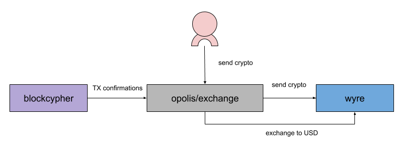

opolis/exchange
===============

Automatically convert incoming bitcoin (BTC) and ethereum (ETH) to USD using Wyre. Powered by AWS.

Created at Opolis with :heart: in Colorado.



## Deployment

**This deployment guide is still under review. Please let us know if you run into any issues or if something isn't
clear by creating an issue in this repo. Any improvements to the process are welcome as pull requests. Thanks!**

This service is a set of AWS Lambda functions, defined within a SAM (serverless-application-model) template. We'll
need to configure some secret values into the AWS Secret Manager, create an S3 bucket, and create an RDS database
instance, before we can deploy the template.

#### Prerequisites

1. [nodejs](https://nodejs.org/en/download/)
1. [AWS](https://aws.amazon.com/account/) account with admin privileges
1. [Wyre](https://www.sendwyre.com/) account
1. [AWS CLI](https://docs.aws.amazon.com/cli/latest/userguide/cli-chap-install.html)
1. [AWS SAM CLI](https://docs.aws.amazon.com/serverless-application-model/latest/developerguide/serverless-sam-cli-install.html)
1. Clone this repository

#### Configure secret parameters

After our accounts and utilities are installed, we'll need to create some entries and placeholders
in the AWS Secrets Manager.

On the Secret Manager [console](https://console.aws.amazon.com/secretsmanager/home), select `Store a new secret`, and
`Other type of secrets`. From there, fill in the following key/value pairs.

```
DB_USER => RDS database user name
DB_PASSWORD => RDS database password (must be at least 8 characters)
MNEMONIC => hot-wallet private key mnemonic *WARNING* be careful with this value. We recommend a 24 word seed.
BLOCKCYPHER_TOKEN => api key generated by BlockCypher
WYRE_ACCOUNT_ID => destination account for USD on your wyre account
WYRE_API_KEY => wyre api key (generated by wyre)
WYRE_SECRET_KEY => wyre secret key (generated by wyre)
```

**Please note that we are investigating other means of handling the private key mnemonic. This provides a reasonable
amount of security, but ideally, the API supports dynamic address generation and thus dynamic key generation.**

Save this as a new secret named `opolis-exchange`.

#### Create S3 bucket

Next, create an S3 bucket we can use to deploy the Lambda artifacts. Create a new, private bucket using
the S3 [console](https://s3.console.aws.amazon.com/s3/home).
Give it a unique name, (we recommend `opolis-exchange-package-*`), where `*` is some unique, meaningful ID to you.

#### Create RDS instance

Next, we'll need a MySQL RDS instance to initialize and configure in the SAM template.

On the [RDS](https://console.aws.amazon.com/rds/home) console, create a new MySQL instance (>= 5.6) and make it
publicly accessible. Make sure to use the database username and password you set above in the `Configure` step.
For now, the DB instance must be publicly accessible, which just means we get a DNS entry, not that connections
are open to the world.

Once the instance is created, make note of the host DNS entry and database name, as we'll need those to configure
our Lambda functions so they can connect.

**Initialize Schema**

In the `db` folder at the root of the repo, you'll find a file called `1-schema.sql`. Using the command line or a
SQL GUI, connect to the database and create the schema by executing the queries in that file. `2-seed.sql` is only
useful in development.

#### Configure non-secret parameters

From here, we can create a `parameters` file locally in the repo to set the rest of the non-secret configuration.
Here's an example.

`parameters`
```
EnvBTCFee=20000 # total BTC fee in satoshis
EnvBTCNetwork=mainnet # mainnet or testnet
EnvBTCThreshold=2 # confirms to wait for before initiating the next BTC tx or wyre exchange
EnvETHThreshold=10 # confirms to wait for before initiating the next ETH tx or wyre exchange (blockcypher has a max of 10)
EnvDBHost=opolis-exchange.xxxxxxxx.us-west-2.rds.amazonaws.com # RDS DNS entry
EnvDBDatabase=exchange # RDS database name inside instance
EnvWyreAddressBTC=... # wyre BTC deposit address (found under "Payment Methods")
EnvWyreAddressETH=... # wyre ETH deposit address (paste **without** `0x`)
```

These values are used to configure the CloudFormation template in the `deploy` step below.

#### Fire it up

Generate some API key credentials in the IAM console, and store them in your `$HOME/.aws/credentials` file under a
new profile name, and be sure to set that as your CLI profile below. Also, set your region to the region where you've
created the other components above.

```
$ export AWS_PROFILE=yourprofile
$ export AWS_REGION=us-west-2
```

Build the Lambda package.

```
$ task/build.sh
```

Using the name of the bucket you created above, upload the package to it.

```
$ task/package.sh opolis-exchange-package-*
```

Using one of the `parameters` file you created above, deploy the SAM template.

```
$ task/deploy.sh parameters
```

#### Generate addresses in the database

Now that the deployment is complete, we can use the admin endpoints to generate some new payers and addresses
in the database.

As part of the CloudFormation template, there is an [IAM group](https://console.aws.amazon.com/iam/home?#/groups)
called `opolis-exchange-AdminGroup*` provisioned. Add your IAM user to that group, and add your credentials to a file
called `.env.aws` (ignored by git)

```
export AWS_ACCESS_KEY_ID=AKI...4UQ
export AWS_SECRET_ACCESS_KEY=dM8...brC
```

```
$ source .env.aws
```

As an output of the CloudFormation deploy, there is a value named `ApiHost`. Copy that value and set it
as an env var.

```
$ export GATEWAY=xxxxxx.execute-api.us-west-2.amazonaws.com
```

Create a new payer. Use an easily identifiable payer name for your database records.

```
$ task/create-payer.sh $GATEWAY PayerName
```

Create a new address for that payer (`BTC` or `ETH`)

```
$ task/create-address.sh $GATEWAY BTC PayerName
```

Any new address created for a payer will increment the last value of the payer's HD path and use that to generate the
actual address, similar to how a regular wallet supports new addresses.

#### Setup BlockCypher confirmation events

Now that we have an address to send to, the last step is to tell BlockCypher to send us confirmation events to our
endpoint.

For the confirmation threshold values, be sure to use the same values you set above in
`Configure non-secret parameters`, and make note that BlockCypher has a limit of 10 confirmations
(excluding the 0-confirmation)

From the CloudFormation output, copy `ApiEndpoint` and set it as an env var. Set your BlockCypher token as well.

```
$ export ENDPOINT="https://xxxxxx.execute-api.us-west-2.amazonaws.com/api"
$ export BLOCKCYPHER_TOKEN=xxxxxx
```

Using the address you got above, create the confirmation event notification.

```
$ webhook/create.sh btc/main 2MzB...vQRY 10 $ENDPOINT/transaction/btc
```

## BlockCypher command reference

```
export BLOCKCYPHER_TOKEN=xxxxxx
export ENDPOINT="https://xxxxxx.execute-api.us-west-2.amazonaws.com/api"
```

**Create a transaction confirmation webhook**

`btc/main`, `eth/main`, and `btc/test3` (public testnet) are all valid network parameters. When using
ETH addresses, omit the `0x`, and use `/transaction/eth` as the endpoint.

```
$ webhook/create.sh btc/main 2MzB...vQRY 10 $ENDPOINT/transaction/btc
```

**List all active webhooks**

```
$ webhook/list.sh
```

**Delete webhook**

Provide the network and webhook ID (returned in `list` response)

```
$ webhook/delete.sh btc/main 06593cbc-662d-4cd5-8263-0e743f9aceba
```

## Admin command reference

```
$ source .env.aws
$ export GATEWAY=xxxxxx.execute-api.us-west-2.amazonaws.com
```

**Create a new payer identity**

```
$ task/create-payer.sh $GATEWAY PayerName
```

**Create a new address for that payer (`BTC` or `ETH`)**

```
$ task/create-address.sh $GATEWAY BTC PayerName
```

## Development

On top of installing the prerequisites in the `Deployment` section above, please install,

1. [docker](https://docs.docker.com/install/)
1. python 2.7+ (useful for running a test locally)

#### Run unit tests

```
$ npm test
```

#### Create local Docker network

Creating a local docker network will allow local invocations of the Lambda functions to connect with MySQL running
inside docker.

```
$ docker network create opolis-exchange
$ docker network ls | grep opolis-exchange
```

If you want to later delete this network,

```
$ docker network rm opolis-exchange
```

#### Start a local MySQL instance

```
$ make mysql
```

This will start a MySQL container as a daemon. To stop it run,

```
$ docker kill mysql
```

#### Running Lambda locally

The AWS SAM CLI tool provides an environment for us to run Lambda functions behind a simulated API Gateway.
To start the API functions run,

```
$ make api
```

Note this only starts the `ListenFunction` and `AdminFunction`. To test an actual transaction
confirmation process (`ProcessFunction`), use the local python script via `make`

```
$ COIN=BTC EVENT=examples/btc.json make invoke
```

